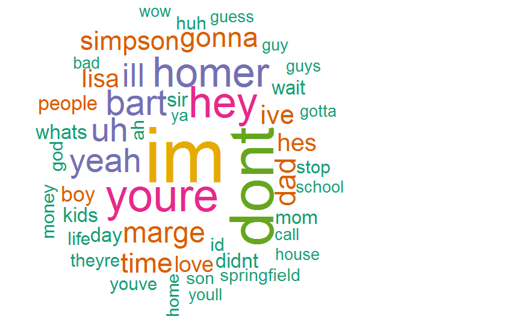

```{r setup, include=FALSE}
knitr::opts_chunk$set(echo = TRUE)
```


# Data Science Portfolio
&NewLine;
&NewLine;

I believe in learning while doing. This data science related portfolio contains some snapshots about things I have done lately.

### 1. Leaflet & GeoJSON 

 

Leaflet is an open-source JavaScript library for building interactive maps. I decided to use an open source data from http://www.hri.fi/en/ which is a service providing Open data from Finland the Helsinki Metropolitan Area for people to use freely.

I created a simple webpage which reads the GeoJSON dataset about Helsinki Region Transport tariff zones and displays zones in a Leaflet map. 

Demo: http://rpubs.com/fieevrasi/372844

GeoJSON data:
http://data.hslhrt.opendata.arcgis.com/datasets/454915a7b25e4a7eac99383c908dc56f_0.geojson

&NewLine;
&NewLine;

### 2. NLP with the TidyText and the Simpsons

During this exercise I will demostrate some natural language processing (NLP) and text mining features. I'm using `tidytext` package and the Simpsons dataset which contains the characters and script lines for the Simpsons episodes.

 
Demo:
https://fieevrasi.github.io/NLP/NLP_Simpsons.html

Data:
https://www.kaggle.com/ambarish/fun-in-text-mining-with-simpsons/data

&NewLine;
&NewLine;

### 3. Practical Machine Learning

In this project, the goal will be to study Pima Indians Diabetes Database and build a machine
learning model to predict whether or not a patient has diabetes.

I'm using `caret` package to compare four different classification methods:

1. K-Nearest Neighbors
2. Logistic regression
3. Random Forest
4. Naive Bayes


Demo:
https://fieevrasi.github.io/ML/practical_ML_diabetes.html

Data:
https://www.kaggle.com/uciml/pima-indians-diabetes-database

